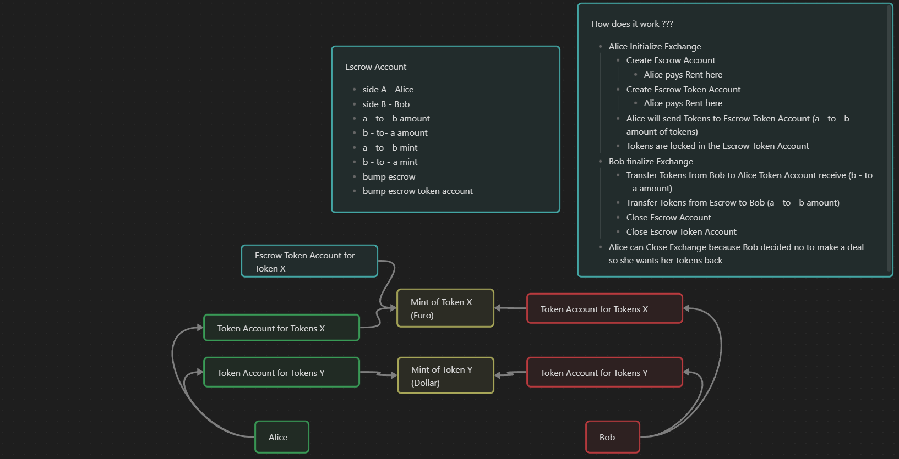

# Escrow program for School of Solana Bonus Lecture

**If you want to run the Tests:**

- use [Solana](https://docs.solana.com/cli/install-solana-cli-tools) v1.17.1

- use [Anchor](https://www.anchor-lang.com/docs/installation) v0.28.0

---

then,
```
yarn install
```
then,
```
anchor test
```

## Structure of the Escrow Program


