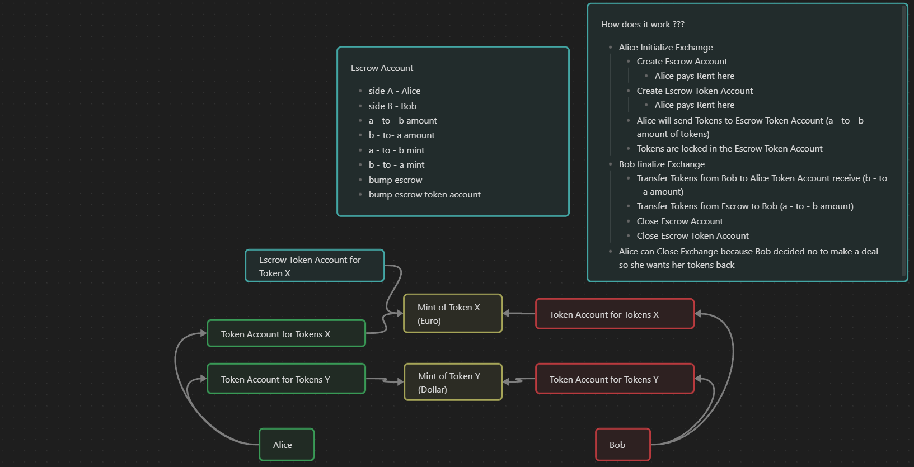

# Escrow program

**If you want to run the Tests:**

- use [Solana](https://solana.com/docs/intro/installation) v2.2.12

- use [Anchor](https://www.anchor-lang.com/docs/installation) v0.31.1

---

then,
```bash
yarn install
```
then,
```bash
anchor test
```

## Structure of the Escrow Program


